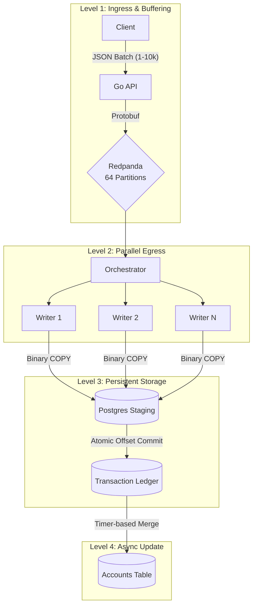

# Transaction Ledger
A distributed transaction ledger capable of persisting 500k+ transactions per second while benchmarking on my system.

<details><summary><b>Narrative</b></summary>
This project serves as my exploration of distributed systems. From humble beginnings as a monolithic API endpoint that directly connected to the database, it has evolved into a complex implementation of a distributed system over its different versions. At first I optimized for throughput, but as I've worked on this project I've realized the importance of durability and reliability in real systems. The initial goal was to just get some understanding of Go and Kafka, but I have thoroughly enjoyed the problem solving opportunities that have been presented while trying to best design this project. I have a better understanding of the tradeoffs that have to be made in a real project, and the optimization problem gave me so much more insight into sytem design and computer architecture.

The goal of this project is to serve as a transaction ledger that receives messages from clients containing transaction information for accounts and then persists them in the database. I have designed the system to achieve effective exactly-once semantics, guaranteeing that if it acknowledges receipt of a transaction it is guaranteed to be eventually be persisted in the database. I have also attempted to achieve linear scalability, theoretically allowing infinite scaling to meet any demand, while still being as efficient as possible with limited hardware. The final goal is to have no single point of failure: the system should be able to recover from a service outage while still guaranteeing data integrity.
</details>

## Data Flow


## Project Structure
```
.
├── cmd
│   ├── api                                 # API server
│   ├── generator                           # Load testing tool
│   ├── seeder                              # Database seeding tool
│   └── worker                              # Database writer service
└── internal
    ├── api
    │   ├── efficientjson.go                # Sonic JSON parsing, main endpoint used
    ├── integration
    │   └── integrationtest.go              # Integration test to validate end-to-end functionality
    ├── storage
    │   ├── binary.go                       # Postgres binary copy protocol implementation
    │   ├── efficienttransactionsource.go   # Efficient Protobuf traversal to avoid unmarshal cost
    └── worker
```

## Achitecture Decisions
#### Key Wins
* **Shared-nothing sharding:** Eliminated mutex contention by partitioning transactions into account specific goroutines.
* **Exactly-once semantics:** Achieved by persisting Redpanda offsets and transaction data in a single atomic Postgres transaction.
* **Zero-copy serialization:** Replaced standard JSON reflection with Sonic to unpack data and utilized Protobuf to handle data internally. Utilized Protobuf wire traversal to avoid the unmarshal cost when writing to Postgres, reducing serialization overhead by 8x.
* **Postgres binary copy:** Manually constructed Postgres binary protocol specification for each write. This eliminates the need to lookup and cast types, enablging a direct write to the table with minimal overhead.

<details><summary><b>Narrative</b></summary>
  
#### API
A stateless API endpoint that sends messages to Redpanda. Clients are expected to send transaction in batches of up to 5000 in JSON format. This is already able to ingest ~2m TPS from my benchmarking, so further optimization may be overkill.

#### Redpanda
A message broker is key to decouple system components. It essentially serves as a write-ahead log for the database. I chose Redpanda over Kafka as I could use the same API, but Redpanda seems like a potentially better modern option. As I have limited system resources, I wanted the efficient C++ Kafka implementation compared to the JVM overhead. Messages are partitioned on account ID across 128 partitions, allowing flexibility for future scaling.

#### Worker
The worker connects to Kafka and pulls messages from assigned partitions. Currently, a single routine fetches records and distributes them to writer goroutines aligned with a single Postgres table partition. This achieves a shared nothing architecture by distributing the work to specialized workers who write to an uncontested table partition, removing issues with lock contention on the Postgres table. The goal here is to have a generalist worker instance that can be easily scaled up to distribute the workload.

#### PostgreSQL
Now that I have a better understanding of other technologies that are available, a different database would probably be more appropriate for high throughput data storage. To optimize Postgres, I've chosen to write to temporary unlogged tables and merge them into a partitioned staging table, attempting to eliminate lock contention between worker goroutines. 

To achieve EOS, I treat the database as the source of truth. Redpanda guarantees at-least-once delivery, and I use an idempotent table merge to ensure only unique transactions are persisted. When the worker starts it pulls the last commited offsets from the database to initialize the Redpanda client connection,  which guarantees that if the system crashes it will simply resume from the previous commit with no data loss.

#### General
I heavily used `sync.Pool` throughout the program to minimize churn from creating objects. From my flame graph analysis, I've effectively eliminated all large scale GC pressure happening on the hot path from my own code.
</details>

## Future Considerations

* Further optimize worker writes to database with a better strategy to distribute work across coress
* Explore potential optimization by rewriting the worker service in Rust/C++

<details><summary><b>Narrative</b></summary>
I've considered some optimizations for the API and the workers to make them even more efficient. For the API, I would like to experiment with multiple Redpanda client connections to spread the work of sending messages across multiple cores. I believe I am limited by using ProduceSync, and I would have to distribute the transaction batch across multiple channels ensuring delivery order to Redpanda while also adding an async callback to handle returning to the client. Other considerations are Protobuf ingestion or even gRPC, but since it is plenty fast with an efficient JSON implementation I've decided to focus on the worker optimizations.

For the workers, I feel like I have reached a bottleneck here that is hard to overcome with the current design. I'm considering moving from a single worker pulling from a single client and routing messages to writer goroutines to a single orchestrator that starts multiple goroutines with individual Redpanda client connections and database connections. I think I am limited by the performance of attempting to pull and route messages on a single thread in my current design.
</details>
